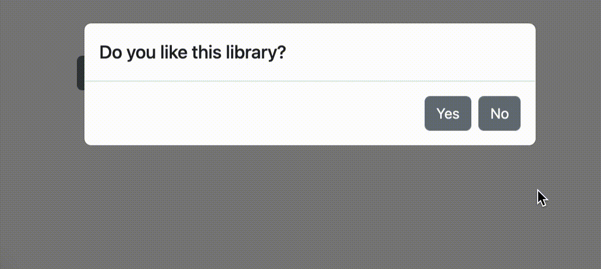

# react-sync-ui

`react-sync-ui` promisify your React Components and make your UI awaitable.

## usage example

```tsx
<button
  onClick={async () => {
    // call synchronous UI workflow with promisified React components

    const likeSyncUI = await syncConfirm("Do you like this library?");

    if (likeSyncUI) {
      await syncAlert("Thanks, we like you too");
    } else {
      const isUserSure = await syncConfirm("Are you sure?");
      if (isUserSure) {
        await syncAlert("Try to give it a second try");
      } else {
        await syncAlert("Thanks, we like you too");
      }
    }
  }}
>
  Run
</button>
```



```tsx
<button
  onClick={async () => {
    const name = await syncPrompt("Fill your name");

    while ((await syncPrompt(`Fill your password!`)) !== "1234") {
      await syncAlert("Invalid password, keep trying");
    }

    await syncAlert(`Congratulation ${name}, you are logged in`);
  }}
>
  Login
</button>
```


`react-sync-ui` provides function `makeSyncUI<InputData, ResolveValue>` which transform your declarative React Components
into the promisified awaitable functions.

```tsx
// defining of your custom react-sync-ui component
export const syncAlert = makeSyncUI<string, void>((props) => (
  <Modal isOpen toggle={() => props.resolve()}>
    <ModalHeader>{props.data}</ModalHeader>
    <ModalFooter>
      <Button onClick={() => props.resolve()}>OK</Button>
    </ModalFooter>
  </Modal>
);
```

## what is `react-sync-ui` solving?

For a long time, I did not like that React's functional way of declarative UI forced you to write nice UI code, but with ugly distributed business logic.
When you have a complex business use case which is a composition of asynchronous actions like HTTP requests together with user interactions,
your business logic code is distributed over many async React handlers and it's really hard to understand the sequence of business logic.

People very often solve this problem by dependencies in the `useEffect(..., [dependency])` which transfer React logic to the event-driven architecture.
When you change the dependency variable value, the different components will register the dependency change, and `useEffect` will be re-called.
With this event-driven programming style, your code complexity is 1000 times more complex, and your newcomer programmes who see the code have the business workflow is.

A nice solution for this problem is to wrap your declarative React components into Promise wrappers which split your UIs into many
smaller functions that can be simply composed together inside of your Javascript function and you'll get very complex business logic in just a few lines of code.

Thanks to `react-sync-ui` you can simply promisify your React Components UI and make your UI awaitable.

And that's why `react-sync-ui` was created. ❤

PS: i took inspiration from awesome functions: `window.alert`, `window.confirm` and `window.prompt`.

## Installation

```bash
npm i react-sync-ui
```

## Usage

### Setup `<SyncUI />` Component into the root of yout project

```tsx
import { SyncUI } from 'react-sync-ui'

const App = () => (
  <>
    <SyncUI />
    <YourAppStuffs />
  <>
)

const root = createRoot(document.getElementById('root')!);
root.render(<App />);

```

### create sync UI

Now, you just have to define your custom React component which will be promisifed by `makeSyncUI` function.

`makeSyncUI` returns Promise which render your custom React Component.
Promise will be resolve when you call `props.resolve(any)` inside of your custom UI.

#### Alert example

```tsx
import { Button, Modal, ModalBody, ModalFooter, ModalHeader } from "reactstrap";
import { makeSyncUI } from "react-sync-ui";

export const syncAlert = makeSyncUI<string, void>((props) => (
  <Modal isOpen={true} toggle={() => props.resolve()}>
    <ModalHeader>{props.data}</ModalHeader>
    <ModalFooter>
      <Button onClick={() => props.resolve()}>OK</Button>
    </ModalFooter>
  </Modal>
);


// usage:

<button
  onClick={async () => {
    await syncAlert("Wait for it...");
    await syncAlert("Wait for it...");
    await syncAlert("You're hacked");
  }}
>
  click to me
</button>;

```

#### Prompt example

```tsx
import { Button, Modal, ModalBody, ModalFooter } from "reactstrap";
import { makeSyncUI } from "react-sync-ui";

export const syncPrompt = makeSyncUI<string, string>((props) => {
  const [input, setInput] = React.useState("");

  return (
    <Modal
      toggle={() => props.reject(new Error("User forced close prompt modal"))}
      isOpen={true}
    >
      <form
        onSubmit={(e) => {
          e.preventDefault();
          setInput("");
          props.resolve(input);
        }}
      >
        <ModalBody>
          <label>
            {props.data}
            <input
              value={input}
              onChange={(e) => setInput(e.target.value)}
              type="text"
            />
          </label>
        </ModalBody>

        <ModalFooter>
          <Button type="submit">Accept</Button>
        </ModalFooter>
      </form>
    </Modal>
  );
});

// usage:

<button
  onClick={async () => {
    const usersFeelings = await syncPrompt("how are you");
  }}
>
  click to me
</button>;
```

#### Confirm example

```tsx
import { Button, Modal, ModalBody, ModalFooter, ModalHeader } from "reactstrap";
import { makeSyncUI } from "react-sync-ui";

export const syncConfirm = makeSyncUI<
  {
    title: string;
    description?: string;
    okBtn?: string;
    notOkBtn?: string;
  },
  boolean
>((props) => (
  <Modal isOpen={true} toggle={() => props.resolve(false)}>
    <ModalHeader>{props.data.title}</ModalHeader>

    <ModalBody>{props.data.description}</ModalBody>

    <ModalFooter>
      <Button autoFocus onClick={() => props.resolve(true)}>
        {props.data.okBtn ?? "Yes"}
      </Button>
      <Button onClick={() => props.resolve(false)}>
        {props.data.notOkBtn ?? "No"}
      </Button>
    </ModalFooter>
  </Modal>
));

// usage:

<button
  onClick={async () => {
    const isOk = await syncConfirm({
      title: "How are you",
      okBtn: "Good",
      notOkBtn: "Not good",
    });
  }}
>
  click to me
</button>;
```
